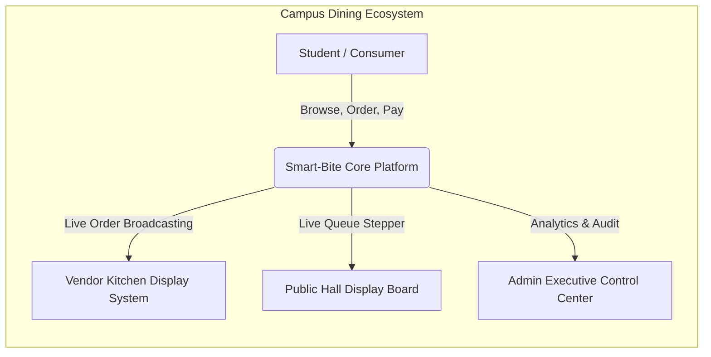
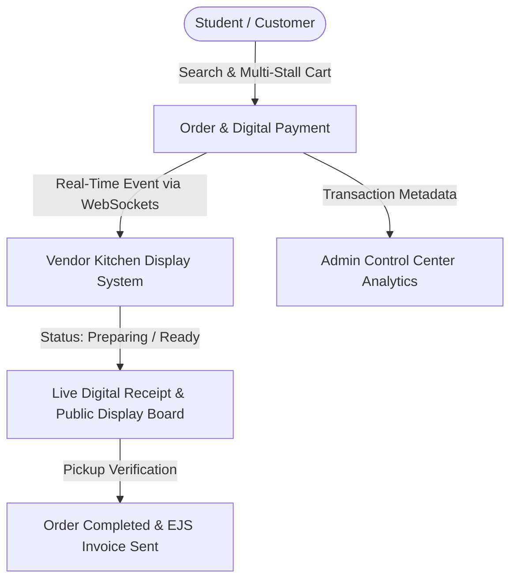
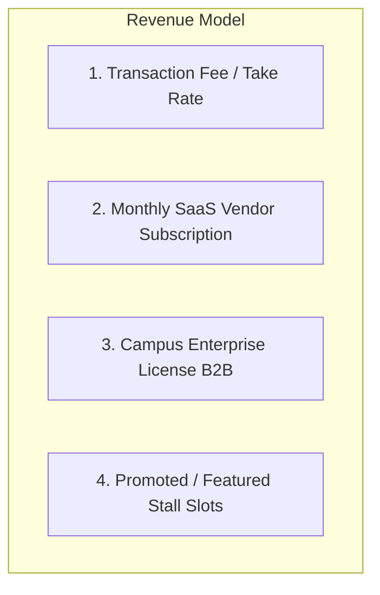
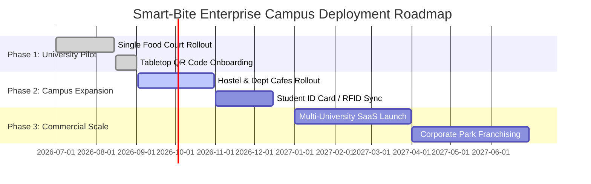

# SGU Smart-Bite Enterprise — Comprehensive Business Document & System Blueprint

**Document Version:** 10.0.0  
**Project Name:** SGU Smart-Bite Enterprise  
**Author / Engineering Team:** Smart-Bite Core Solutions Group  
**Target Audience:** University Management, Food Court Vendors, Investors, Product Stakeholders, and Technical Architecture Teams  
**Date:** September 2026  

---

## Executive Summary

**SGU Smart-Bite Enterprise** is a next-generation, cloud-native, real-time campus dining and food court orchestration platform. Designed specifically for high-density academic and corporate environments, Smart-Bite eliminates peak-hour queues, streamlines multi-stall kitchen workflows, guarantees payment reconciliation, and provides end-to-end operational visibility through live event-driven communication.

By bridging students, multi-vendor kitchens, and institutional administrators into a unified digital ecosystem, Smart-Bite transforms the traditional, congested canteen into a **Zero-Wait Smart Food Court**.



---

## 1. Problem Statement & Market Opportunity

### 1.1 The Campus Dining Bottleneck
In collegiate and corporate campuses, thousands of students and employees converge on food courts during narrow peak timeframes (lunch hours, class breaks). Traditional operations suffer from severe systemic friction:

1. **Massive Physical Queues & Lost Productivity:** Students spend 20–35 minutes standing in line to order and pay, followed by another 15–20 minutes waiting for food pickup.
2. **Order Errors & Miscommunication:** Manual paper tokens and verbal shouting lead to wrong orders, forgotten customizations, and dish delays.
3. **Cash Leakage & Reconciliation Headaches:** Stalls face manual cash tally errors, unpaid pickups, and end-of-day settlement discrepancies.
4. **Kitchen Overwhelm & Stock Blindness:** Vendors lack real-time visibility into incoming demand spikes and run out of high-demand ingredients without ability to immediately update menu availability.
5. **Zero Institutional Governance:** Campus management lacks real-time insight into tenant sales, food court hygiene metrics, vendor performance SLAs, or student satisfaction.

### 1.2 The Smart-Bite Opportunity
Smart-Bite addresses these friction points through a single, hardware-light web application accessible instantly on smartphones, tablets, and smart TVs without requiring native app downloads.

| Traditional Canteen Model | SGU Smart-Bite Enterprise Model |
| :--- | :--- |
| 20–40 min physical wait times | 0 min queue; pre-order from lecture hall or desk |
| Paper slips & verbal token callouts | Synchronized Kitchen Display System (KDS) & Live Public Board |
| Disjointed cash & manual UPI checks | Idempotent digital payments & automated digital invoicing |
| Static printed chalk/paper menus | Real-time stock toggle, dynamic pricing, & digital menu editor |
| Zero data analytics for university | Executive analytics: GMV, peak hour metrics, tenant health |

---

## 2. Product Ecosystem & Core Modules

Smart-Bite is structured into four tightly integrated sub-systems:



### 2.1 Student & Customer Ordering Portal
- **Interactive Multi-Stall Directory:** Explore diverse campus stalls (e.g., *Southern Delight, Rohit Vadewale, Oodles of Noodles, Narayana, Cool Cravings, Tea & Coffee*).
- **Smart Menus & Dynamic Filters:** Filter by dietary preference (100% Pure Veg, Non-Veg), category pills (*Thalipeeth, Dosa, Noodles, Shakes, Wraps*), and instant search.
- **Cross-Stall Smart Cart:** Add items across multiple food court counters into a unified cart with single-step checkout.
- **Digital Payment Hub & Cash-on-Delivery Options:** Seamless integration supporting UPI, credit/debit cards, campus wallet, and monitored cash pickup.
- **Live Digital Receipt & Visual Stepper:** Real-time visual tracking (`Order Placed` ➔ `In the Kitchen` ➔ `Ready for Pickup` ➔ `Completed`) powered by instant WebSocket triggers.
- **Automated Digital Invoicing:** Transactional EJS email receipts dispatched straight to the student’s verified email address.

### 2.2 Vendor Kitchen Display System (KDS) & Operations Hub
- **Real-Time Kitchen Ticket Queue:** Instant visual cards segmented into `Active Queue`, `Preparing`, and `Ready for Collection`.
- **Audio & Haptic Alerts:** Auditory chimes upon new incoming tickets to keep kitchen staff alert during peak rush.
- **Live Stock & Menu Editor:** Real-time modal editor to update dish name, price in INR (₹), categories, dish imagery, and instant stock/availability toggles without page refreshes.
- **Congestion & Wait-Time Management:** One-click toggle for **Busy Mode** and dynamic wait-time broadcasting (e.g., "+15 mins estimated prep") to set accurate customer expectations.
- **Stall Status Control:** Instant toggle between `Online` (accepting orders) and `Offline` (counter closed).

### 2.3 Public Hall Order Board (Big-Screen Display)
- **Zero-Touch Campus TV Interface:** Full-screen, responsive order queue display engineered for wall-mounted TVs in dining halls.
- **Dual Column Pipeline:** Clear distinction between `Now Preparing 🍳` and `Ready for Pickup 🔔`.
- **Instant Token Highlighting:** Large legible order IDs and customer names enabling students to collect food immediately upon notification.

### 2.4 Executive Admin Control Center
- **Campus Food Court Overview:** Real-time metrics on Gross Merchandise Value (GMV), Total Campus Orders, Active Food Counters, and Total Students.
- **Vendor Performance Audits:** Monitor individual stall sales volume, preparation turnaround times, and rating feedback.
- **Multi-Role User Governance:** Role-Based Access Control (RBAC) managing Students, Guests, Stall Operators, and Campus System Admins.
- **System Health & Audit Logs:** Live database status monitoring, PostgreSQL/SQLite failover indicators, and emergency configuration controls.

---

## 3. Business Model & Monetization Strategy

Smart-Bite creates tangible value for all stakeholders, enabling flexible monetization pathways:



### 3.1 Monetization Streams
1. **Transaction Take-Rate (1.5% – 3.5% per Order):** Micro-commission on every digital transaction processed through the platform.
2. **Vendor SaaS Subscription (₹499 – ₹1,499 / stall / month):** Tiered subscription for vendors unlocking advanced menu scheduling, item analytics, automated inventory warnings, and customer preference reports.
3. **Enterprise Campus Licensing (B2B SaaS):** Annual recurring software contract with educational institutions and corporate IT parks for brand white-labeling, custom student ID authentication (SSO / LDAP), and campus ERP integration.
4. **Featured Promotions & Sponsored Banners:** Prime placement for stalls running special daily meal combos, seasonal beverages, or festival discounts.

### 3.2 Value Proposition & ROI for Stakeholders

| Stakeholder | Key Value Delivered | Tangible ROI Metric |
| :--- | :--- | :--- |
| **Students & Staff** | Zero waiting in physical queues; pre-ordering between lectures; digital receipts. | Saves 20–35 minutes per meal break. |
| **Food Court Vendors** | 35%+ increase in order capacity; reduced staffing at counter; zero cash leakages. | Higher order throughput during peak 60-minute lunch windows. |
| **University Management** | Clean, organized food court halls; transparent revenue auditing; enhanced campus life tech. | 100% auditable tenant revenue data; improved campus rating. |

---

## 4. Technical Architecture & System Design

Smart-Bite utilizes an enterprise, reactive architecture prioritizing 99.9% uptime, zero latency, and responsive performance on mobile devices.

```mermaid
graph TB
    subgraph Client Layer
        A1[Customer Mobile Web App]
        A2[Vendor Tablet KDS]
        A3[Public TV Display Board]
        A4[Admin Control Center]
    end

    subgraph Edge & API Gateway
        B1[Vercel Serverless / Node.js Express 5.x API]
        B2[Socket.io Real-Time Event Bus]
        B3[Helmet, CORS, Rate Limiters, JWT RBAC]
    end

    subgraph Data & Storage Layer
        C1[(PostgreSQL / Supabase)]
        C2[(SQLite Local Failover Engine)]
        C3[(In-Memory Safe Transaction Store)]
    end

    subgraph Integration Services
        D1[EJS Email Engine / SMTP Service]
        D2[Payment Gateway / Idempotency Verifier]
    end

    Client Layer <--> Edge & API Gateway
    Edge & API Gateway <--> Data & Storage Layer
    Edge & API Gateway <--> Integration Services
```

### 4.1 Technology Stack Summary
- **Frontend Framework:** React 18 with Vite for sub-second hot reloading and optimized production bundles.
- **Styling & UI Architecture:** Tailwind CSS v4, Framer Motion for micro-interactions, Lucide Icons, and Canvas Confetti for delightful order confirmations.
- **Backend Runtime:** Node.js (v18+) with Express 5.x API architecture.
- **Real-Time Communication:** Socket.io bi-directional WebSocket event channels for live state sync across stalls, customers, and display screens.
- **Database Engine:** Multi-tiered storage with Supabase PostgreSQL as primary, automated SQLite fallback, and resilient In-Memory store for offline resilience.
- **Security & Reliability:** JSON Web Tokens (JWT), bcrypt password hashing, HTTP-only cookie support, Helmet header protection, and API rate limiting.
- **Email Delivery:** EJS HTML templating with automated Nodemailer dispatch.

---

## 5. Security, Governance & Operational Continuity

1. **Role-Based Access Control (RBAC):** Strictly demarcated permissions across `student`, `guest`, `owner` (vendor), and `admin`.
2. **Idempotent Payment Processing:** Every payment creation and verification is protected by unique `idempotencyKey` and `transactionRef` tracking to prevent double charges.
3. **Graceful Degradation & High Availability:** If primary cloud database connections experience disruption, the server automatically routes traffic through its local persistence engine without dropping in-flight orders.
4. **Data Privacy:** User passwords hashed with salt rounds via `bcryptjs`; student contact info protected under institutional compliance standards.

---

## 6. Strategic Rollout Plan & Milestones



1. **Phase 1 — University Pilot (Completed):** Deployed across core SGU Food Court stalls (*Southern Delight, Narayana, Rohit Vadewale, etc.*) with table QR codes and vendor dashboard setup.
2. **Phase 2 — Campus Expansion (Current):** Onboarding all satellite kiosks, hostel mess facilities, and integrating direct student campus wallet payment options.
3. **Phase 3 — Multi-Campus & Corporate SaaS:** Packaging Smart-Bite as a turnkey B2B SaaS platform for universities, engineering colleges, and IT tech park food courts nationwide.

---

## 7. Key Performance Indicators (KPIs)

To evaluate system impact, Smart-Bite tracks four core operational metrics:

$$\text{Order Turnaround Time (TAT)} = T_{\text{Ready}} - T_{\text{Placed}}$$

$$\text{Peak Hour Throughput} = \frac{\text{Total Fulfilled Orders}}{\text{Peak Window Hours}}$$

- **Average Queue Reduction:** Target $> 80\%$ decrease in physical queue time.
- **Vendor Fulfillment SLA:** Target $< 8\text{ minutes}$ average preparation time for fast-food items.
- **Digital Adoption Rate:** Target $> 75\%$ of all campus food court orders placed digitally.
- **Order Accuracy:** Target $> 99.5\%$ error-free fulfillment.

---

*© 2026 SGU Smart-Bite Enterprise. All Rights Reserved. Confidential Business Document.*
